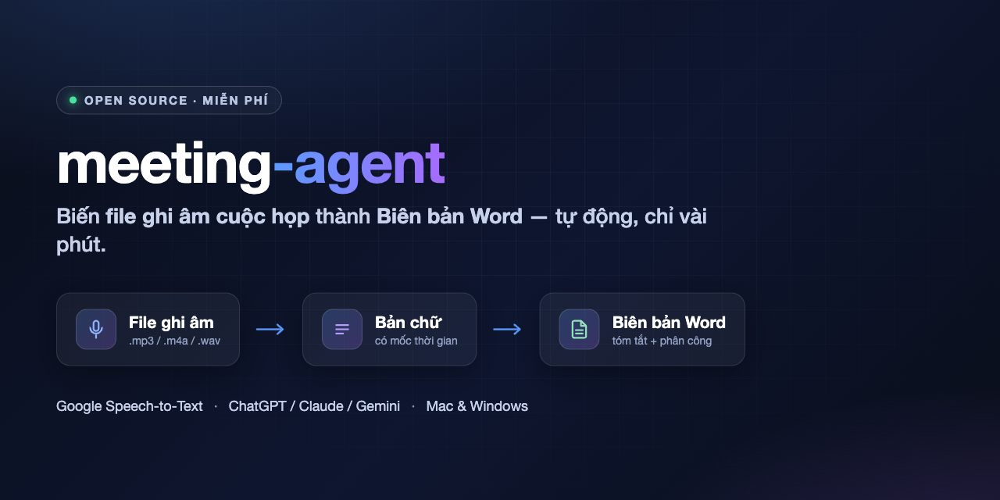

<p align="center">
  
</p>

<h1 align="center">🎙️ meeting-agent</h1>
<p align="center"><b>Biến file ghi âm cuộc họp thành Biên bản Word — tự động</b></p>

<p align="center">
  <a href="docs/01-tao-google-cloud.md">📖 Hướng dẫn cài đặt (có ảnh từng bước)</a> ·
  <a href="docs/03-su-dung.md">▶️ Cách dùng</a> ·
  <a href="#-bảo-mật--riêng-tư">🔒 Bảo mật</a>
</p>

---

Bạn có một **file ghi âm cuộc họp** (từ điện thoại, Zoom, Google Meet...) và muốn có ngay một
**biên bản cuộc họp** gọn gàng: tóm tắt nội dung, các quyết định, **bảng phân công ai làm việc gì**?

`meeting-agent` giúp bạn làm điều đó qua **3 bước**, chạy được trên **cả Mac và Windows**,
và **không cần biết lập trình**.

```
   🎧 File ghi âm            📝 Bản chữ (transcript)         📄 Biên bản Word
  (.m4a / .mp3 / .wav)  ──►   có mốc thời gian        ──►    (tóm tắt + phân công)
                          (Google Speech-to-Text)        (nhờ AI bạn đang dùng viết)
```

> 💡 **Điểm hay:** phần "viết biên bản" **dùng chính con AI bạn đang có** (ChatGPT, Claude,
> Gemini... kể cả bản miễn phí) — chỉ copy & dán, **không tốn thêm phí API**.

---

## Cần chuẩn bị gì?
1. Một tài khoản **Google** (Gmail) — để dùng dịch vụ bóc băng (60 phút miễn phí/tháng).
2. Một AI trò chuyện bất kỳ bạn đang dùng — để viết biên bản.
3. Khoảng **15 phút cài đặt lần đầu**. Sau đó mỗi cuộc họp chỉ mất vài phút.

---

## Bắt đầu — làm theo đúng thứ tự

| Bước | Làm gì | Hướng dẫn |
|------|--------|-----------|
| **1** | Tạo "chìa khóa" Google Cloud (`key.json`) | 👉 [docs/01-tao-google-cloud.md](docs/01-tao-google-cloud.md) |
| **2** | Cài Python + ffmpeg trên máy | 👉 [docs/02-cai-dat.md](docs/02-cai-dat.md) |
| **3** | Bóc băng → nhờ AI → xuất Word | 👉 [docs/03-su-dung.md](docs/03-su-dung.md) |
| **4** *(tùy chọn)* | Đẩy công việc lên Google Sheet Gantt | 👉 [docs/04-day-task-len-gantt.md](docs/04-day-task-len-gantt.md) |

### Tóm tắt cách dùng (sau khi đã cài xong)
```bash
# 1) File ghi âm → văn bản
python transcribe.py "hop-cong-ty.m4a"

# 2) Copy transcript + prompts/prompt-bien-ban.txt → dán vào ChatGPT/Claude/Gemini
#    → lưu kết quả thành bienban.md

# 3) văn bản → file Word
python make_bienban.py bienban.md
```

### Muốn xem thành phẩm ngay (không cần file ghi âm)
```bash
python make_bienban.py examples/bienban-mau.md
```

---

## Có gì trong thư mục này?
```
meeting-agent/
├── transcribe.py         # Bóc băng: file ghi âm → transcript (dùng Google Speech-to-Text)
├── make_bienban.py       # Dựng Word: biên bản Markdown → .docx (không cần cài thêm gì)
├── push_to_gantt.py      # (Tùy chọn) đẩy công việc trong biên bản → Google Sheet Gantt
├── prompts/
│   └── prompt-bien-ban.txt   # Câu lệnh mẫu để nhờ AI viết biên bản
├── examples/             # Transcript & biên bản mẫu (dữ liệu giả để thử)
├── docs/                 # 3 file hướng dẫn từng bước
├── setup.sh / setup.bat  # Cài đặt tự động (Mac/Linux | Windows)
└── requirements.txt
```

---

## 🔒 Bảo mật & riêng tư
- File **`key.json`** (chìa khóa Google) và **file ghi âm / transcript** đều là dữ liệu riêng tư.
  Phần mềm đã cấu hình sẵn `.gitignore` để bạn **không lỡ tay đẩy chúng lên GitHub**.
- File ghi âm chỉ được gửi tạm lên Google để nhận dạng chữ, xử lý xong là xóa khỏi bộ nhớ tạm.
- Đừng chia sẻ `key.json` cho bất kỳ ai.

## Câu hỏi thường gặp
- **Có mất tiền không?** 60 phút bóc băng đầu mỗi tháng miễn phí. Quá thì ~400đ/phút. Phần viết biên bản dùng AI có sẵn nên miễn phí.
- **Nói tiếng Việt được không?** Được, mặc định là tiếng Việt (`vi-VN`).
- **Nhiều người nói có phân biệt được ai nói không?** Bản này tập trung nội dung; AI sẽ suy ra vai trò người nói từ ngữ cảnh khi viết biên bản.
- **Họp online thì sao?** Bật ghi âm của Zoom/Meet, tải file về rồi làm như bình thường.

---

## Giấy phép
[MIT](LICENSE) — tự do dùng, chỉnh sửa, chia sẻ.
