# Bước 1 — Tạo "chìa khóa" Google Cloud (làm 1 lần duy nhất)

> Để máy tính bóc được file ghi âm thành chữ, ta mượn dịch vụ **Speech-to-Text của Google**.
> Bạn cần tạo một tài khoản Google Cloud và tải về **1 file chìa khóa** (`key.json`).
> Nghe hơi kỹ thuật nhưng cứ làm tuần tự bên dưới là xong, khoảng **10–15 phút**.

> 💡 **Chi phí:** Google cho **60 phút bóc băng MIỄN PHÍ mỗi tháng**. Quá 60 phút thì tính
> khoảng **~400đ/phút** (họp 1 tiếng ≈ 24.000đ). Google **không tự trừ tiền** nếu bạn chưa
> chủ động bật thẻ; và bạn có thể đặt hạn mức để không lo phát sinh.

---

## 1.1. Đăng nhập & đăng ký nhận $300 miễn phí
1. Vào **https://console.cloud.google.com** bằng tài khoản Gmail của bạn.
2. Lần đầu, bấm **Get started for free** (Bắt đầu miễn phí) để nhận **$300 tín dụng, dùng trong 90 ngày**.

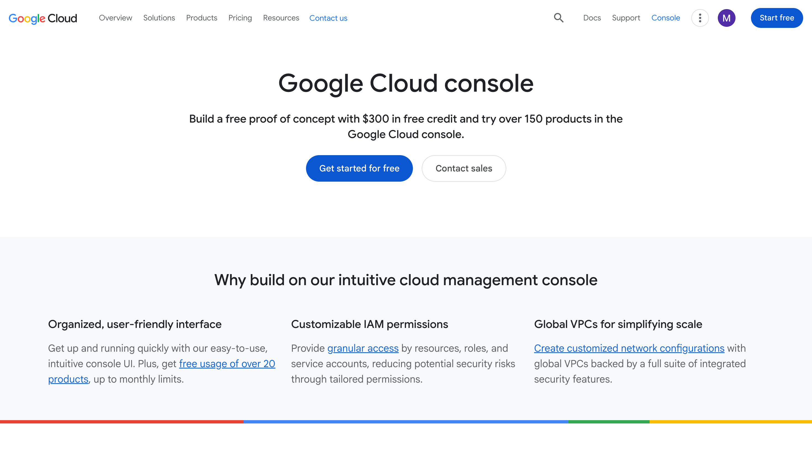

3. **Bước 1/2 — Account Information:** chọn Quốc gia (Vietnam), đồng ý điều khoản → **Agree & continue**.

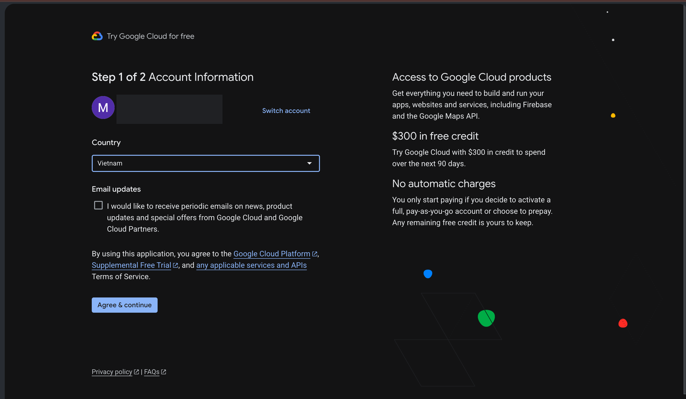

4. **Bước 2/2 — Payment Information:** điền thông tin liên hệ (chọn Individual/cá nhân cho đơn giản).

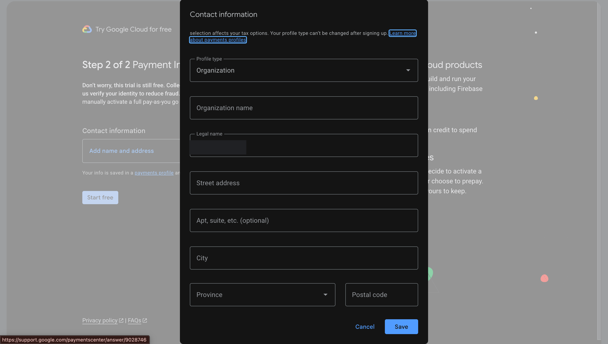

5. **Thêm thẻ để xác minh:** bấm **Add payment method → Add credit or debit card**, nhập **thẻ Visa/Mastercard quốc tế** (KHÔNG dùng thẻ ATM nội địa).

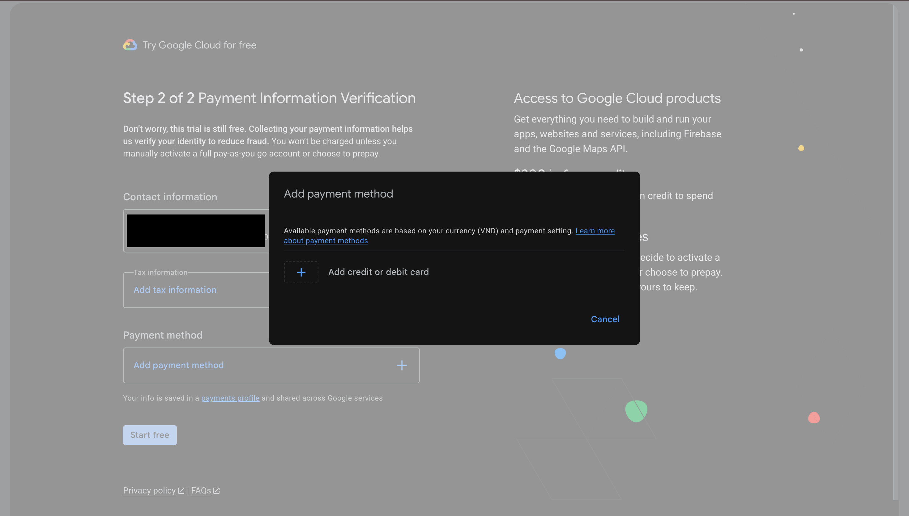

> 💳 **Về tiền:** thêm thẻ chỉ để Google **xác minh danh tính**. Bạn nhận **$300 free trong 90 ngày** và Google **KHÔNG tự trừ tiền** khi hết trial (phải tự bấm nâng cấp mới bị tính). Ngoài ra Speech-to-Text còn **60 phút/tháng miễn phí vĩnh viễn**.

## 1.2. Tạo một "Project" (dự án)
Sau khi đăng nhập, bạn thấy màn hình chính (Dashboard):

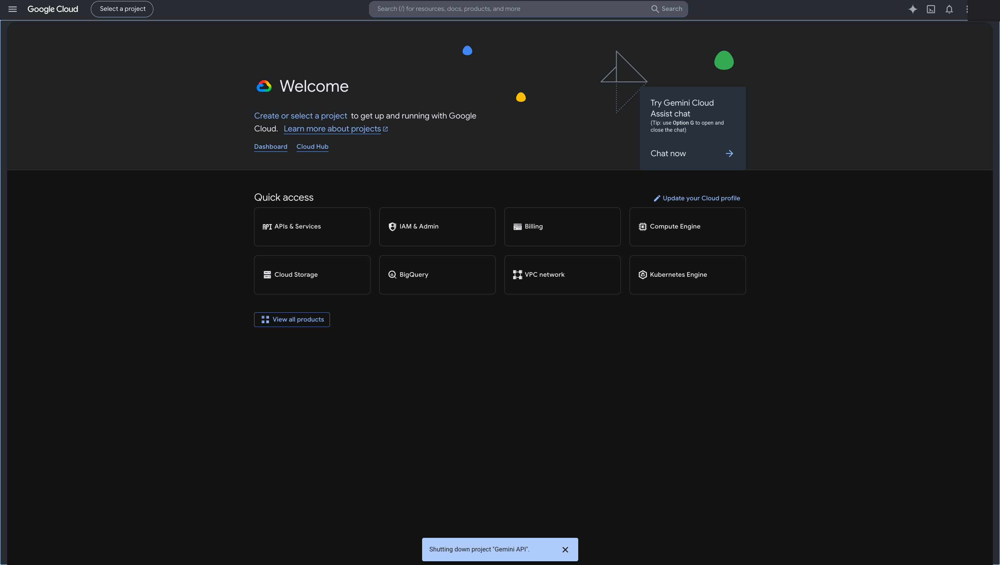

1. Ở thanh trên cùng, bấm **Select a project** (cạnh chữ "Google Cloud").
2. Trong cửa sổ hiện ra, bấm **New Project** (góc trên bên phải).

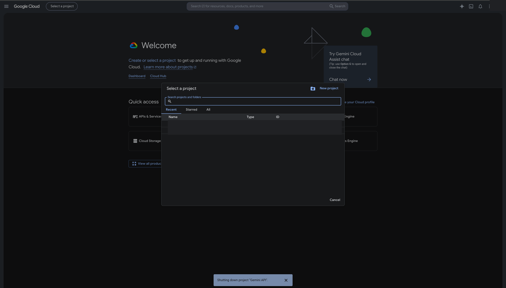

3. Đặt tên, ví dụ `bien-ban-hop`, để nguyên các mục còn lại → bấm **Create**.

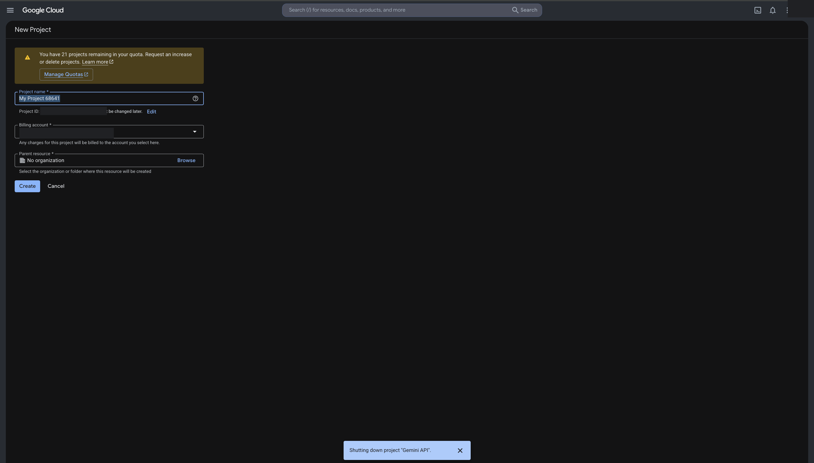

4. Chờ vài giây, rồi bấm lại ô chọn project và **chọn đúng project vừa tạo**.

## 1.3. Bật dịch vụ Speech-to-Text
**Cách 1 (nhanh):** vào thẳng link **https://console.cloud.google.com/apis/library/speech.googleapis.com** → bấm **Enable**.

**Cách 2 (theo menu):** trong project, mở menu **☰ → APIs & Services → Library**:

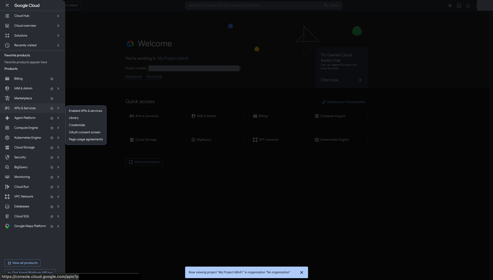

→ gõ tìm **"Speech-to-Text"** → mở kết quả → bấm nút **Enable** (Bật). Chờ đến khi hiện "API enabled".

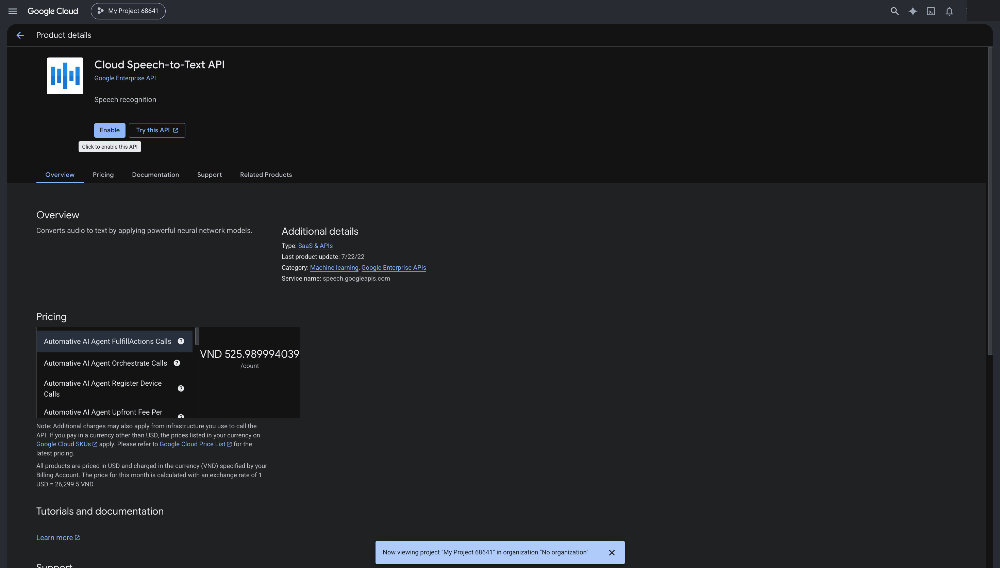

## 1.4. Thanh toán (Billing)
- Nếu bạn **đã đăng ký free trial ở mục 1.1** (thêm thẻ, nhận $300) → **Billing đã bật sẵn**, bỏ qua mục này.
- Nếu chưa: vào **https://console.cloud.google.com/billing** → **Link a billing account** / **Create account** → thêm thẻ Visa/Mastercard → gắn vào project.

## 1.5. Tạo "Service Account" và tải file chìa khóa (`key.json`)
Đây là bước tạo ra file chìa khóa cho phần mềm dùng.

1. Vào **https://console.cloud.google.com/iam-admin/serviceaccounts**
   (hoặc `APIs & Services → Credentials → Create credentials → Service account`).

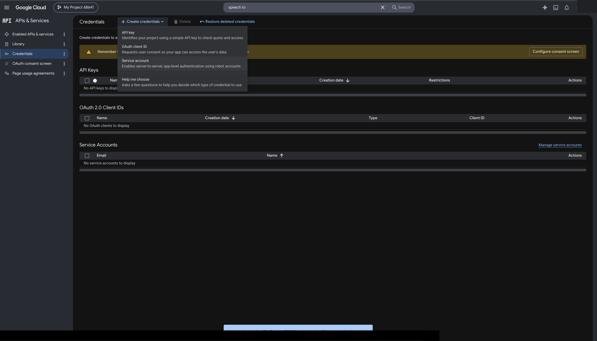

2. **Bước 1 — Service account details:** đặt tên, ví dụ `meeting-agent` → **Create and Continue**.

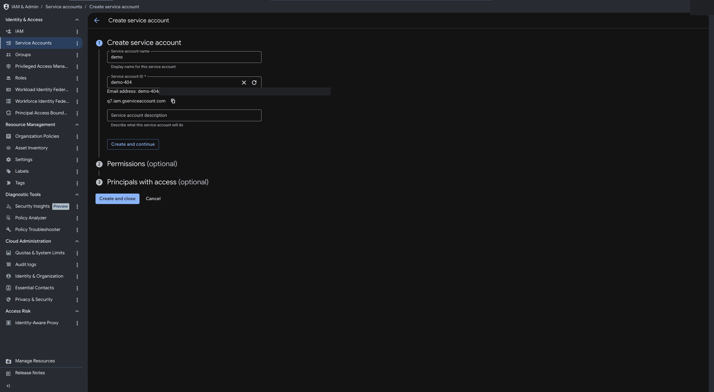

3. **Bước 2 — Permissions (cấp quyền):** ở ô **Select a role**, gõ tìm **"speech"** → chọn **Cloud Speech Administrator** (hoặc Cloud Speech Client) → **Continue**.

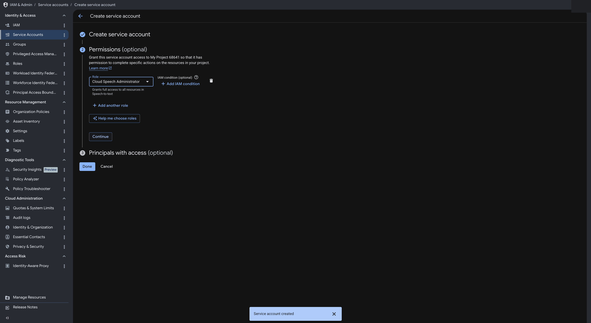

4. **Bước 3 — Principals with access:** để trống (không cần) → bấm **Done**.
5. Trong danh sách, bấm vào service account vừa tạo → tab **Keys → Add Key → Create new key → JSON → Create**.
6. Trình duyệt **tải về 1 file `.json`** — đây chính là **chìa khóa** của bạn.

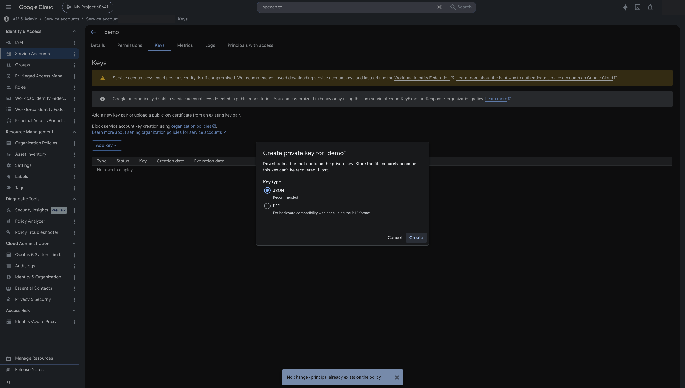

## 1.6. Đặt file chìa khóa vào đúng chỗ
1. Đổi tên file vừa tải thành **`key.json`**.
2. **Copy vào thư mục `meeting-agent`** (ngay cạnh file `transcribe.py`).

✅ **Xong bước 1.** File `key.json` đã sẵn sàng. Sang **docs/02-cai-dat.md**.

---

---

## (Tùy chọn nâng cao) Không cần key.json nếu bạn đã dùng gcloud
Nếu bạn là người quen kỹ thuật và đã cài **gcloud CLI**, có thể bỏ qua việc tạo `key.json`:
```
gcloud auth application-default login
gcloud config set project <TÊN-PROJECT-CỦA-BẠN>
```
Tool sẽ tự nhận đăng nhập này. Người dùng phổ thông cứ dùng `key.json` như trên cho đơn giản.

---

## ⚠️ Lưu ý bảo mật (rất quan trọng)
- File `key.json` giống như **chìa khóa nhà** — ai có nó cũng dùng được tài khoản Google Cloud của bạn.
- **KHÔNG** gửi file này cho ai, **KHÔNG** đưa lên GitHub / Facebook / email.
- Phần mềm đã tự động chặn (`.gitignore`) để bạn không lỡ tay đẩy `key.json` lên mạng.
- Nếu lỡ để lộ: vào lại mục **Service Accounts → Keys**, xóa key cũ và tạo key mới.
